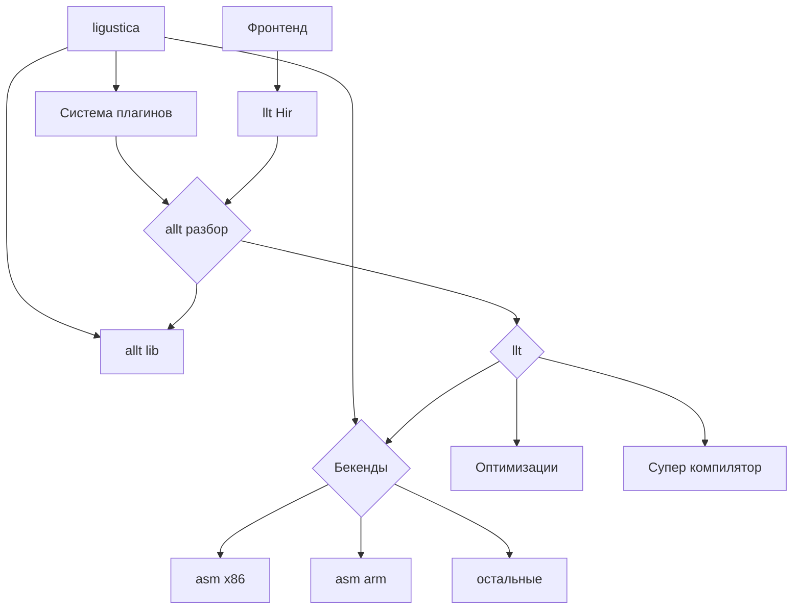

# LLT project

Целевая инфраструктура для генерации целевого кода.

> Ligustica - менеджер плагинов, бэкендов и библиотек
> Allt - обёртка над LLT, которая превращает KIR(AST) в HIR-LLT, выполняет оптимизации, проверяет типы и работает с библиотеками
> LLT - переводит HIR в указанный бэкенд
> LLSC - суперкомпилятор для глубокой оптимизации (пока что только идея на стадии планирования)

