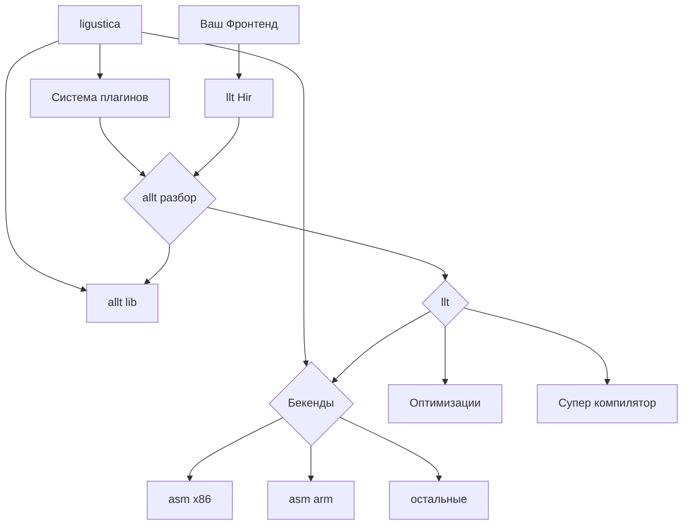

# llt project

llt предоставляет набор повторно используемых компонентов для построения компиляторов, включая промежуточное представление, оптимизации и backend-инфраструктуру.

```mermaid
graph TD
  F[Ваш Фронтенд] --> IR[llt Hir]

  L[ligustica] --> SP[Система плагинов]
  L --> aLIB
  L --> BK

  SP --> ALLT

  IR --> ALLT{allt разбор}

  ALLT --> aLIB[allt lib]

  
  ALLT --> LLT{llt} --> OPT[Оптимизации]

  LLT --> BK{Бекенды}
  LLT --> LLSC[Супер компилятор]

  BK --> A86[asm x86]
  BK --> AARM[asm arm]
  BK --> ITD[остальные]
```
